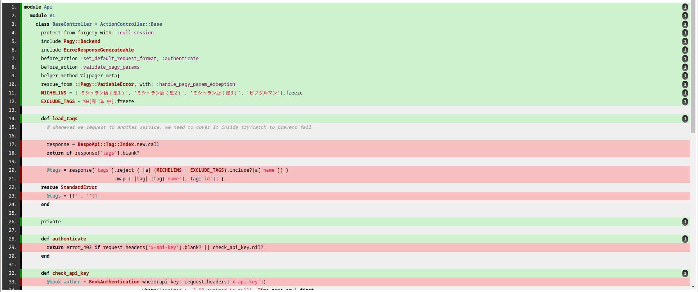
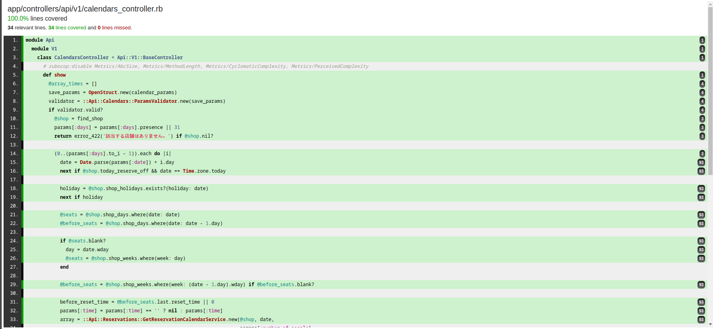
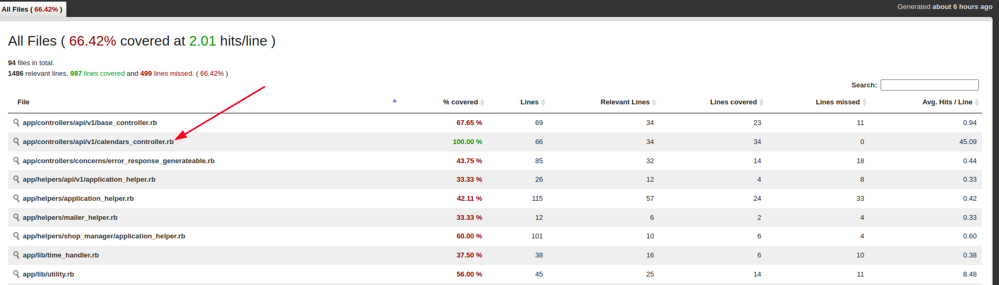
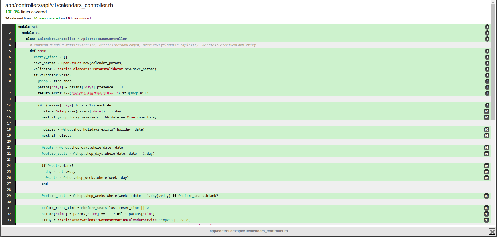

## Initial Setup

Consider a basic Rails controller structure:
```
module Api

module V1

class TestController < Api::V1::BaseController
# Controller Code here
end
```

## Step 1: Initial Test Generation

1. Use a simple prompt with Copilot:
```
Generate a rspec test for this controller , the rspec should have a better coverage and include all the edge cases
```
2. Copilot generates an initial test case.
3. Note: This initial test will likely fail and have insufficient coverage due to lack of context.

## Step 2: Iterative Improvement

1. Modify the prompt to request additional context:
```
Can you fix this error in my test case, Ask for any files or reference you need to solve this error before fixing 
```
2. Provide requested files (e.g., models, schema) to Copilot.
3. Copilot generates a more contextually aware test case.

## Step 3: Handling Hallucinations

1. If Copilot begins to hallucinate after multiple iterations:
    - Start a new chat session.
    - Provide specific issues and guide Copilot's focus.

## Step 4: Manual Intervention and Guided Fixes

1. Analyze the code yourself to identify specific issues.
2. Ask Copilot to fix these specific issues, providing detailed context.
3. Iterate until all tests are passing.

## Step 5: Improving Code Coverage

1. Use SimpleCov to generate a coverage report.
2. Identify uncovered lines in the report:



`Green lines indicate covered code, red lines indicate uncovered code.`

3. Target uncovered lines:
```
Please write additional test cases to cover the following uncovered lines: [provide uncovered lines]
```



## Conclusion

Through this iterative process, leveraging GitHub Copilot's capabilities alongside manual guidance and specific prompts, we can generate comprehensive RSpec tests with 100% code coverage for our Rails controller.

## Note

While GitHub Copilot is a powerful tool for generating test ideas and code snippets, it should not be relied upon exclusively. Always use your own understanding and critical thinking when crafting tests. Copilot is most effective when combined with your expertise and domain knowledge. Remember, the quality of your tests ultimately depends on your ability to analyze, reason, and implement robust test cases.

## Example
For Controller
```
module Api
  module V1
    class CalendarsController < Api::V1::BaseController
      # rubocop:disable Metrics/AbcSize, Metrics/MethodLength, Metrics/CyclomaticComplexity, Metrics/PerceivedComplexity
      def show
        @array_times = []
        save_params = OpenStruct.new(calendar_params)
        validator = ::Api::Calendars::ParamsValidator.new(save_params)
        if validator.valid?
          @shop = find_shop
          params[:days] = params[:days].presence || 31
          return error_422('該当する店舗はありません。') if @shop.nil?

          (0..(params[:days].to_i - 1)).each do |i|
            date = Date.parse(params[:date]) + i.day
            next if @shop.today_reserve_off && date == Time.zone.today

            holiday = @shop.shop_holidays.exists?(holiday: date)
            next if holiday

            @seats = @shop.shop_days.where(date: date)
            @before_seats = @shop.shop_days.where(date: date - 1.day)

            if @seats.blank?
              day = date.wday
              @seats = @shop.shop_weeks.where(week: day)
            end

            @before_seats = @shop.shop_weeks.where(week: (date - 1.day).wday) if @before_seats.blank?

            before_reset_time = @before_seats.last.reset_time || 0
            params[:time] = params[:time] == '' ? nil : params[:time]
            array = ::Api::Reservations::GetReservationCalendarService.new(@shop, date,
                                                                           params[:number_of_people],
                                                                           params[:time], @seats,
                                                                           before_reset_time).perform!

            @array_times += array
          end

          @array_times = @array_times.map { |date| Time.zone.at(date).strftime('%Y/%m/%d') }.uniq
        else
          error_422(validator.errors.to_hash(true))
        end
      end
      # rubocop:enable Metrics/AbcSize, Metrics/MethodLength, Metrics/CyclomaticComplexity, Metrics/PerceivedComplexity

      private

      def find_shop
        Shop.find(params[:id])
      rescue StandardError
        nil
      end

      def calendar_params
        params.permit(
          :date,
          :days,
          :number_of_people,
          :time
        )
      end
    end
  end
end
```
The final test code was:
```
require 'rails_helper'

RSpec.describe Api::V1::CalendarsController, type: :controller do
  describe 'GET #show' do
    let(:payment_type) { PaymentType.create!(name: "Credit Card") }
    let(:prefecture) { Prefecture.create!(name: "Tokyo", code: "TKY") }
    let(:brand) { Brand.create!(name: "Test Brand") }
    let(:before_seat_double) { double('BeforeSeat', reset_time: Time.now) }
    let(:seat_double) { double('Seat') }


    let(:owner) do
      Owner.create!(
        payment_type: payment_type,
        login_id: "1234bfdgg23323",
        identify_code: "unique_identify_code",
        name: "Owner Name",
        name_kana: "オーナーネーム",
        director_name: "Director Name",
        director_name_kana: "ディレクターネーム",
        staff_name: "Staff Name",
        staff_name_kana: "スタッフネーム",
        prefecture_id: prefecture.id,
        postcode: "1234567",
        email: "owner@example.com",
        confirm_email: "owner@example.com",
        city: "City",
        address: "Address",
        full_address: "Full Address",
        phone: "0901234567",
        password_digest: "password",
        status: 10,
        is_deleted: false
      )
    end

    let(:shop_administrator) do
      ShopAdministrator.create!(
        email: "admin@example.com",
        login_id: "admin_login",
        password: "password",
        owner: owner
      )
    end

    let(:shop) do
      Shop.create!(
        prefecture: prefecture,
        shop_administrator: shop_administrator,
        name: "Shop Name",
        name_kana: "ショップネーム",
        tel: "09012345678",
        zipcode: "1234567",
        address: "Address",
        access: "Access",
        enable: true,
        shop_images_attributes: [
          {
            image_id: "test_image_id",
            image_name: "test.png",
            image_size: 2,
            seq: 1,
          }
        ]
      )
    end

    let(:date) { Date.today }
    let(:params) { { id: shop.id, date: date, days: 31, number_of_people: 2, time: '10:00' } }

    before do
      allow(controller).to receive(:authenticate).and_return(true)
      allow(controller).to receive(:find_shop).and_return(shop)
      allow(shop).to receive(:today_reserve_off).and_return(false)
      allow(shop).to receive_message_chain(:shop_holidays, :exists?).and_return(false)
      allow(shop).to receive_message_chain(:shop_days, :where).and_return([])
      allow(shop).to receive_message_chain(:shop_weeks, :where).and_return([double(reset_time: 0)])
    end

    context 'when validator is valid' do
      let(:validator) { instance_double('Api::Calendars::ParamsValidator', valid?: true) }
      let(:array_times) { [Time.now.to_i, (Time.now + 1.day).to_i] }

      before do
        allow(Api::Calendars::ParamsValidator).to receive(:new).and_return(validator)
        allow(::Api::Reservations::GetReservationCalendarService).to receive(:new).and_return(double(perform!: array_times))
      end

      it 'assigns the shop' do
        get :show, params: params
        Rails.logger.debug "Assigned shop: #{assigns(:shop).inspect}"
        expect(assigns(:shop)).to eq(shop)
      end

      it 'assigns the array_times' do
        get :show, params: params
        expect(assigns(:array_times)).to eq(array_times.map { |date| Time.zone.at(date).strftime('%Y/%m/%d') })
      end

      it 'renders the show template' do
        get :show, params: params
        expect(response).to render_template(:show)
      end
    end

    context 'when validator is invalid' do
      let(:validator) { instance_double('Api::Calendars::ParamsValidator', valid?: false) }
      let(:errors) { { date: ['is invalid'] } }

      before do
        allow(Api::Calendars::ParamsValidator).to receive(:new).and_return(validator)
        allow(validator).to receive(:valid?).and_return(false)
        allow(validator).to receive(:errors).and_return(double(to_hash: errors))
        allow(controller).to receive(:error_422)
      end

      it 'calls error_422 with the correct errors' do
        get :show, params: params
        expect(controller).to have_received(:error_422).with(errors)
      end
    end

    context 'when shop is not found' do
      before do
        allow(Shop).to receive(:find).and_raise(ActiveRecord::RecordNotFound)
        allow(controller).to receive(:find_shop).and_call_original
      end

      it 'returns nil for find_shop' do
        expect(controller.send(:find_shop)).to be_nil
      end
    end
  end
end
```
# Coverage



